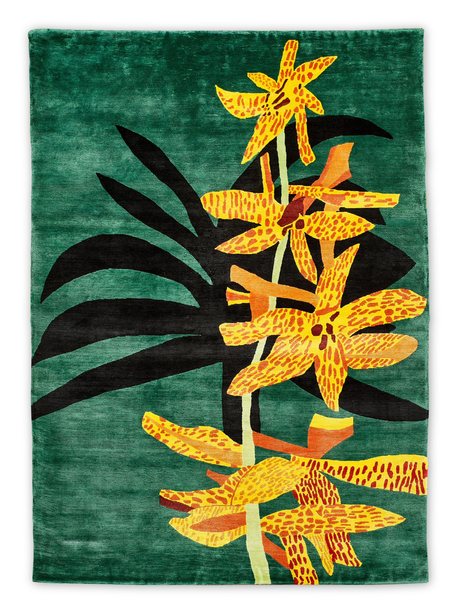



```{webr}
#| label: setup
#| include: false
#| autorun: true

theme_set(theme_classic())

art <- read.csv("artDataset.csv")
classroster <- read.csv("classroster.csv", fileEncoding="UTF-8-BOM")
```

# Association and correlation

## Exercise 1

In your pairs, try to think of two variables that, in the real world, that might have this correlation for each of the following correlations. Try to think of a few examples for each correlation.

-   0.75
-   0.25
-   0.0
-   -0.25
-   -0.75

Pick a few of these and draw by hand what you expect these graphs to look like.

```{webr}
#| label: pick1

sample(classroster$name, 1)
```

## Exercise 2 - Art

{width="800"}

## Viewing an example relationship

-   First, what is our expectation about the relationship between height (cm) and width (cm) of paintings sold recently at [Sotheby's](https://www.sothebys.com/en/buy/fine-art/contemporary?locale=en)?
-   Direction?
-   Form?
-   Strength?
-   Outliers?

```{webr}
#| label: hwfirstlook
ggplot(art, aes(x=height_cm, y=width_cm)) +
  geom_point(alpha=0.8) +
  labs(
    x = "Height (cm)",
    y = "Width (cm)"
  )
```

Which variable should be the response variable? Why?

## Height and width - direction

A scatterplot is the easiest way to check for direction. In this case, the direction is obvious

```{webr}
#| label: hwdirection
height_mean <- mean(art$height_cm, na.rm = TRUE)
width_mean  <- mean(art$width_cm, na.rm = TRUE)

direction <- ggplot(art, aes(x = height_cm, y = width_cm)) +
  
  # Add the quadrant-dividing lines
  geom_vline(
    xintercept = height_mean,
    linetype = "dashed"
  ) +
  geom_hline(
    yintercept = width_mean,
    linetype = "dashed"
  ) +
  labs(
    x = "Height (cm)",
    y = "Width (cm)"
  )

# Plot all points in gray
direction +  geom_point(alpha = 0.8) 
```

```{webr}
#| label: hwdirection2
direction + 
  geom_point(color = "gray70", alpha = 0.7) +
  
  # Overlay lower-left and upper-right points in red
  geom_point(
    data = subset(
      art,
      (height_cm < height_mean & width_cm < width_mean) |
      (height_cm > height_mean & width_cm > width_mean)
    ),
    color = "red",
    alpha = 0.8
  ) 
```

## Height and width - form

```{webr}
#| label: hwform
ggplot(art, aes(x = height_cm, y = width_cm)) +
  geom_point(alpha = 0.6) +
  geom_smooth(
    method = "loess",
    se = FALSE
  ) +
  labs(
    x = "Height (cm)",
    y = "Width (cm)",
    subtitle = "Does the smooth trend appear roughly straight or curved?"
  )
```

## Height and width - strength

```{webr}
#| label: hwstrength
ggplot(art, aes(x = height_cm, y = width_cm)) +
  geom_point(alpha = 0.6) +
  stat_ellipse(
    level = 0.95,
    linewidth = 1,
    color="red"
  ) +
  labs(
    x = "Height (cm)",
    y = "Width (cm)",
    subtitle = "How tightly are the points clustered within the ellipse?"
  )
```

### Correlation as a measure of strength

```{webr}
#| label: hwcorr
kable(art %>% 
        summarize(cor(height_cm, width_cm, use="complete.obs")), col.names="Correlation")
```

This correlation is perhaps what we expected

-   In general, mechanically generated processes with little noise can have very high correlations
-   Most correlations of social or real world processes rarely have above moderate correlation due to noise

## Height and width - outlier

Again, we do not have a rule for selecting outliers other than to observe them on the scatterplot. In this case, there is one very obvious value far from other values

```{webr}
#| label: hwoutlierplot
ggplot(art, aes(x=height_cm, y=width_cm)) + 
  geom_point()  +
  geom_text(data=art %>% filter(height_cm > 200), # Filter data first
            aes(label=title), vjust=1.2, hjust=1, color="red") +
  geom_text(data=art %>% filter(height_cm > 150 & width_cm < 50), # Filter data first
            aes(label=title), vjust=1.2 , color="red") +
  labs(x="Height (cm)", y="Width (cm)")
```

To investigate if these outliers matters, we can check some other values of the observation.

```{webr}
#| label: hwoutliers
kable(
  art %>%
    filter((height_cm > 150 & width_cm < 50) | height_cm > 200) %>%
    select(c(price, artist, title, width_cm, height_cm, area_cm2)))
```

What kind of outliers do you think these are? Why?

### Outliers - actual observations

{width="800"}

{width="800"}

https://www.sothebys.com/en/buy/auction/2021/contemporary-showcase-kawaii-pop/yellow-and-orange-orchid-clipping-huang-ju-se-lan

### Data with no outlier

```{webr}
#| label: hwnooutlier
#| message: false
art_nooutlier <- art %>%
  filter(height_cm < 150 | width_cm > 50)

ggplot(art_nooutlier, aes(x=height_cm, y=width_cm)) + 
    geom_point(position="jitter") +
    geom_smooth(method="loess", se=FALSE) +
    labs(x="Height (cm)", y="Width (cm)")
```

How much do you think the correlation will change?

```{webr}
#| label: hwcorrnooutlier
kable(art_nooutlier %>% 
        summarize(cor(height_cm, width_cm, use="complete.obs")), col.names="Correlation")
```

### Describing the association

1.  Direction - positive
2.  Form - linear
3.  Strength - strong
4.  Outliers - one(ish)? possible

Outlier:

```{webr}
#| label:  hwoutlier2
kable(
  art %>%   
    filter(height_cm > 150 & width_cm < 50) %>%
    select(c(price, artist, title, width_cm, height_cm, area_cm2)))
```

## Does bed and square feet relationship match expectations?

-   Not surprisingly, the higher the painting, the wider it (usually) is (positive relationship)
-   The relationship is fairly linear (form is lineaer)
-   Most points are relatively "clustered" indicating a strong relationship (relationship is strong)
-   Outlier analysis leads to some potential issues

### Your turn

With your partner, develop some expectations about whether the variable `area_cm2` and `price` in the `art` dataset might be related.

What to do with your partner:

1.  Write down what you expect the relationship to be between these two variables based on any prior knowledge
2.  Decide which variable is the response variable and which is the predictor variable
3.  Make a scatterplot using one of the codeblocks in the previous section and identify the features of the association

```{webr}
#| label: pick3
sample(classroster$name, 1)
```